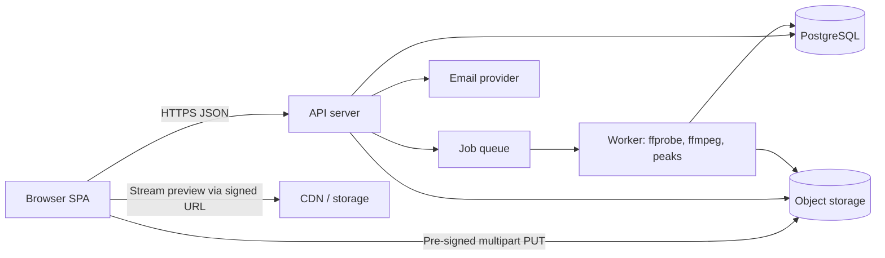
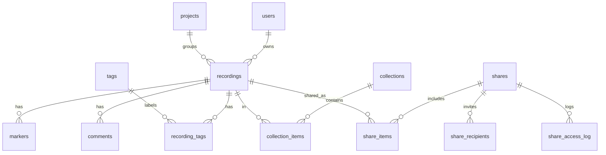

# Field Recording Library — Build Plan

Working name: **FieldLog**. A web app for a documentary filmmaker to upload, preview, tag, search and share field recordings with a sound editor.

---

## 1. Purpose and Scope

### 1.1 Goal
Give one filmmaker (the Owner) a private, reliable library for field recordings, and a controlled way to hand selected recordings to a sound editor (a Collaborator) without emailing large files.

### 1.2 Users and Roles
| Role | Description | Capabilities |
|---|---|---|
| Owner | The filmmaker. Full control. | Upload, edit, tag, delete, search, create shares, invite collaborators, manage account |
| Collaborator | The sound editor. Invited by Owner. | Sign in (optional), view and play only items shared with them, download if permitted, leave comments |
| Guest (link recipient) | Anyone with a share link | View/play/download only the shared set, per link settings. No account |

Single-owner by design for v1; the data model carries an `owner_id` so multi-user can be added later.

### 1.3 In Scope (v1)
- Account sign-in for Owner; invited accounts for Collaborators
- Upload of audio files (single, multiple, drag and drop), resumable for large files
- Automatic metadata extraction and waveform generation
- Playable list with in-browser preview
- Tagging (free-form tags, plus structured fields: location, date, project, notes)
- Search and filter
- Sharing with a sound editor (private invite or expiring link), with comments
- Download of originals
- Admin-level safety: backups, audit log, rate limits

### 1.4 Out of Scope (v1)
- Audio editing, trimming, effects
- Automatic transcription / AI tagging (listed under Future)
- Mobile native apps (the web app must be responsive and work on a phone browser)
- Multi-tenant teams, billing

### 1.5 Success Criteria
- Upload a 2 GB WAV on a flaky connection and have it complete via resume.
- Find a recording by tag, place or note within 3 seconds in a 20,000-item library.
- Start playback of a recording within 2 seconds of clicking it.
- Editor can open a share link on a laptop and hear/download the files with no account.
- Owner can revoke any share instantly.

---

## 2. Assumptions and Open Questions

Assumptions (the coding agent should build to these unless the owner overrides):
1. Library size: up to ~20,000 recordings, ~2 TB total; individual files up to 4 GB.
2. Formats: WAV (incl. BWF/RF64), AIFF, FLAC, MP3, M4A/AAC, OGG/Opus.
3. Language: English UI only (strings externalised so more can be added).
4. Hosting: a single cloud region; object storage for audio; managed Postgres.
5. Budget-conscious: avoid services with large fixed monthly cost.

Open questions to confirm with the owner before build starts:
- Does the editor need to upload files back (e.g. edited versions)? Plan: **no for v1**, designed so it can be added.
- Should downloads of shared originals be allowed by default? Plan: **yes, per-share toggle**.
- Any confidentiality requirements (e.g. interview subjects, legal)? Affects retention and region.
- Preferred sign-in method (email + password, or email magic link / Google)? Plan: magic link plus optional password.

---

## 3. Recommended Technology Stack

Chosen for being mainstream, well-documented and easy for a coding agent to build and for a human to maintain.

| Layer | Choice | Reason |
|---|---|---|
| Front end | React + TypeScript, Vite, React Router, TanStack Query, Tailwind CSS | Common, productive, strong typing |
| Audio playback/waveform | Web Audio via `wavesurfer.js` using server-supplied precomputed peaks | Fast display without downloading the original |
| Back end | Node.js + TypeScript, Fastify (or NestJS), Zod for validation | Typed end to end |
| Database | PostgreSQL 15+ with full-text search (`tsvector`) and `pg_trgm` | Search without extra infra |
| File storage | S3-compatible object storage (AWS S3, Cloudflare R2 or Backblaze B2) | Cheap, durable, supports resumable multipart upload |
| Upload protocol | S3 multipart upload via pre-signed URLs, or tus protocol | Resumable large uploads direct to storage |
| Background jobs | Postgres-backed queue (pg-boss) or BullMQ + Redis | Metadata extraction, transcoding, cleanup |
| Audio processing | `ffmpeg` / `ffprobe` in the worker | Metadata, preview transcoding, waveform peaks |
| Auth | Session cookies (HttpOnly) with email magic link; argon2id for optional passwords | Simple, safe |
| Email | Transactional provider (Postmark, Resend or SES) | Invites, magic links |
| Hosting | Container-based (Fly.io, Render, Railway, or AWS ECS) for API + worker; static front end on CDN | Straightforward |
| Observability | Structured JSON logs, Sentry for errors, uptime check | Production readiness |
| CI/CD | GitHub Actions: lint, type-check, test, build, deploy | |

Alternatives are acceptable if the agent documents the reason, but must preserve the behaviours in this plan.

### 3.1 Architecture Overview



Key principle: **audio bytes never pass through the API server**. The browser uploads straight to storage, and plays/downloads through short-lived signed URLs.

---

## 4. Screens and Navigation

### 4.1 Site Map
- `/login` — Sign in
- `/` — Library (default after sign-in)
- `/recordings/:id` — Recording detail
- `/upload` — Upload (also available as a drawer/modal from Library)
- `/collections` — Collections list (named groups, e.g. "Episode 3 ambience")
- `/collections/:id` — Collection detail
- `/shares` — Shares management (Owner)
- `/s/:token` — Public share view (Guest)
- `/shared` — "Shared with me" (Collaborator, signed in)
- `/tags` — Tag manager
- `/settings` — Account, storage usage, collaborators, security
- `/404`, `/error`

### 4.2 Global Layout
- Top bar: app name, global search box (always visible, shortcut `/`), Upload button, user menu.
- Left nav (collapsible; bottom tab bar on phones): Library, Collections, Shares, Tags, Settings.
- Persistent **mini player** at the bottom: current recording title, play/pause, scrub bar, time, volume, next/previous in list. Playback continues while navigating.
- Toast area for success/error messages.
- Keyboard shortcuts help (`?`).

### 4.3 Screen Specifications

#### 4.3.1 Login (`/login`)
- Fields: email. Button "Email me a sign-in link". Optional "Use password instead" reveals password field.
- Behaviour: always show the same confirmation ("If that address is registered, a link is on its way") to avoid revealing which emails exist.
- Magic link valid 15 minutes, single use.
- States: idle, sending, sent, error, rate-limited.

#### 4.3.2 Library (`/`)
The main working screen.
- **Toolbar**: search box, filters button, sort dropdown, view toggle (List / Compact / Grid), selection mode, Upload button.
- **Filter panel** (side or drawer): tags (multi-select, AND/OR toggle), date recorded range, location, project, duration range, file format, sample rate, status (e.g. Processing, Ready, Failed), shared/not shared, rating, "untagged".
- **List rows** each show: play button, mini waveform, title, duration, date recorded, location, tags (chips, truncated with +N), format badge, shared indicator, rating, kebab menu.
- **Row behaviours**:
  - Click play: loads preview in mini player; click again pauses.
  - Click title: opens detail.
  - Hover/long-press: quick actions (add tag, share, download, delete).
  - Space bar toggles play on the focused row; arrow keys move focus.
- **Bulk actions** (checkbox selection, shift-click range, "select all matching search"): add/remove tags, add to collection, set project/location, share, download as ZIP, delete.
- **Pagination**: infinite scroll with cursor paging, 50 per page; total count displayed.
- **Empty states**: first-time (large drop zone, "Drag your recordings here"), no results (suggest clearing filters), all processing.
- **Processing items** show a progress indicator and are playable once the preview is ready; the original is always preserved.
- Drag-and-drop of files anywhere on the page opens the upload drawer.

#### 4.3.3 Upload (drawer/page)
- Drop zone plus "Choose files" and "Choose folder".
- Queue table: filename, size, progress bar, status (Queued, Uploading, Paused, Processing, Done, Failed, Duplicate), pause/resume/cancel/retry per file, overall progress.
- Concurrency: 3 files in parallel, 5 parts in parallel per file (configurable).
- Before upload, optional **batch defaults**: project, location, tags, date recorded, applied to the whole batch.
- Validation before sending: extension and MIME check, size limit, zero-byte rejection; clear message per rejected file.
- Duplicate detection: compute SHA-256 in browser (Web Worker, chunked); if it matches an existing recording, offer "Skip" or "Upload anyway".
- Survives page refresh: incomplete uploads are listed with "Resume" (user must reselect the file; app verifies size and hash match).
- Warn on closing the tab while uploads are active.
- After completion: "View in library" and "Add details to these N recordings" (opens batch metadata edit).

#### 4.3.4 Recording Detail (`/recordings/:id`)
- Header: editable title, status, back link, prev/next within the current list context.
- **Player panel**: large waveform with click-to-seek, zoom in/out, play/pause, skip ±5 s, loop region (drag to select), playback speed (0.5x–2x), volume, time/position, keyboard controls (`Space`, `←/→`, `J/K/L`).
- **Markers**: Owner can add timestamped notes on the waveform (e.g. "dog bark at 02:14"). Listed beneath the player; click to jump.
- **Details panel** (editable inline, autosaves with visible "Saved" indicator):
  - Title, description/notes (plain text, up to 5,000 chars)
  - Tags (typeahead chips; create on Enter)
  - Date and time recorded (prefilled from file metadata, otherwise upload date)
  - Location (text; optional latitude/longitude with small map picker — v1 may be text plus manual coordinates)
  - Project, Collection(s)
  - Rating (0–5 stars), Flag (e.g. "Best take", "Needs cleanup", "Do not use")
  - Recordist, microphone/equipment (free text)
- **Technical info** (read-only): original filename, format/codec, duration, sample rate, bit depth, channels, bitrate, file size, checksum, uploaded at, embedded metadata (BWF description, originator, timecode where present).
- **Sharing panel**: who has access, create share, revoke.
- **Comments** thread (Owner and Collaborators with access).
- **Actions**: download original, download preview (MP3), replace tags, duplicate metadata to others, delete (with confirmation; goes to Trash).
- Activity log for this item (uploaded, edited, shared, downloaded).

#### 4.3.5 Collections (`/collections`, `/collections/:id`)
- Grid of named collections with item counts and cover waveform.
- Create, rename, describe, delete (items remain in the library).
- Detail view is the same list component as Library, scoped to the collection, with manual ordering via drag-and-drop.
- "Share this collection" action.

#### 4.3.6 Shares (`/shares`) — Owner
- Table of shares: name, what is shared (N recordings / collection), recipient (email or "Link"), created, expires, permissions, last accessed, access count, status (Active, Expired, Revoked).
- Actions: copy link, edit, extend expiry, revoke, view access history.
- **Create/Edit share dialog**:
  - Select items (from current selection, a collection, or search).
  - Recipient type: *Invite by email* (Collaborator account) or *Anyone with the link*.
  - Permissions: Play (always), Download originals (toggle), Download previews only, Comment (toggle).
  - Expiry: 7 / 30 / 90 days / custom / never (never requires an extra confirmation).
  - Optional passcode for link shares.
  - Optional message to the recipient.
  - "Dynamic" toggle: when sharing a collection, new items added later become visible (default off).
- On creation: email sent to invited recipients; link shown with Copy button.

#### 4.3.7 Public Share View (`/s/:token`)
- Minimal branded page: share title, owner's message, expiry notice.
- Passcode gate if set.
- List of shared recordings with play, waveform, technical info, notes the Owner chose to expose, comments (if enabled), download buttons (if permitted), "Download all as ZIP".
- No access to anything outside the share. Shows friendly messages for expired/revoked/invalid links, without revealing which.

#### 4.3.8 Shared With Me (`/shared`) — Collaborator
- Same as public view, but listing all shares granted to the signed-in account, with a "New" badge for unseen items and ability to mark as reviewed.

#### 4.3.9 Tags (`/tags`)
- List of tags with usage counts, colours, search.
- Rename, merge two tags, delete (with count of affected recordings), change colour.
- Optional tag groups/categories (e.g. "Sound type", "Mood", "Quality").

#### 4.3.10 Trash
- Deleted recordings stay 30 days, can be restored or permanently deleted. Accessed from Library menu or Settings.

#### 4.3.11 Settings (`/settings`)
- Profile: name, email, time zone.
- Security: sign-in methods, password set/change, active sessions with "sign out everywhere", optional two-factor (TOTP).
- Collaborators: invite, list, remove.
- Storage: used/available, breakdown by project, largest files.
- Preferences: default sort, default view, default download permission, density.
- Data: export library metadata (CSV/JSON), delete account.

### 4.4 Cross-Screen UX Requirements
- **Responsive**: usable from 360 px width up. List collapses to compact rows on phones; the filter panel becomes a bottom sheet.
- **Accessibility**: WCAG 2.2 AA. Full keyboard operation; visible focus; ARIA roles for player controls; waveform has a text alternative and a slider fallback for seeking; colour is never the only signal; respects reduced motion; contrast at least 4.5:1.
- **Visual design**: calm, dark-mode friendly (editors often work in dim rooms); light and dark themes, following system by default.
- **Feedback**: every async action has loading, success and failure states; destructive actions confirmed; undo for tag/delete where feasible via toast.
- **Performance**: virtualised lists; lazy-load waveforms; skeleton loaders; target Largest Contentful Paint under 2.5 s on broadband.
- **Offline/poor network**: uploads resume; API calls retry with backoff; clear "You are offline" banner.

---

## 5. Features and Behaviours (Detailed)

### 5.1 Upload Pipeline
1. Client requests an upload session: `POST /uploads` with filename, size, MIME, SHA-256 (optional), and batch defaults.
2. Server validates (size limit, extension allow-list, quota), creates a `recording` in status `uploading`, starts a storage multipart upload, and returns part size and pre-signed part URLs (or tus endpoint).
3. Client uploads parts in parallel, retrying each failed part up to 5 times with exponential backoff; reports progress.
4. Client calls `POST /uploads/:id/complete` with part ETags. Server completes the multipart upload, verifies size, and enqueues the processing job; status becomes `processing`.
5. Worker:
   - Runs `ffprobe` to confirm it is valid audio and extract technical metadata (codec, duration, sample rate, bit depth, channels, bitrate, embedded tags and BWF fields).
   - Computes SHA-256 if the client did not supply one and detects duplicates.
   - Generates a **preview** (MP3 or AAC, 128–192 kbps, stereo downmix, loudness untouched) so browsers can play any format, including multichannel WAV.
   - Generates **waveform peaks** (JSON, ~1,000–4,000 points, min/max per bucket) and a small PNG thumbnail if useful.
   - Updates the recording to `ready` or `failed` with an error reason.
6. Abandoned incomplete uploads are aborted and storage cleaned after 7 days (scheduled job).
7. Original is never modified. Preview and peaks are derived and can be regenerated.

Edge cases: corrupt file (mark failed, allow delete or retry), unsupported codec, file renamed with wrong extension (detect by content), extremely long files (> 12 hours: allowed but warn), filenames with unicode/spaces, upload of the same file twice, quota exceeded mid-upload, expired pre-signed URLs (client asks for new ones).

### 5.2 Playback
- Previews streamed from a signed URL with HTTP Range support for seeking.
- Waveform drawn from stored peaks so it appears instantly.
- Only one recording plays at a time.
- Remember last position per recording for the Owner (optional, off by default).
- Signed URLs expire in 15 minutes; the client refreshes transparently.

### 5.3 Tagging
- Tags are case-insensitive, trimmed, 1–50 chars, unique per owner; stored normalised with a display name.
- Typeahead suggests existing tags; Enter or comma creates.
- Tags may be added/removed individually or in bulk.
- Optional tag colour and group.
- Merge: all recordings with tag B receive tag A; B is removed; reversible within 30 days via audit entry (best effort).
- Suggested tags: the app may suggest tags based on filename keywords and location (simple rule-based; no AI in v1).

### 5.4 Search and Filtering
- **Free-text** across title, description, notes, tags, location, project, original filename, recordist, markers, comments.
- Postgres full-text with prefix matching, plus trigram fuzzy match for typos.
- **Query syntax** (optional power feature): `tag:wind`, `-tag:music`, `loc:"Lake Natron"`, `date:2026-05..2026-06`, `dur:>30s`, `fmt:wav`, `rating:>=4`, `is:shared`. Invalid syntax falls back to plain text and shows a hint.
- **Filters** combine with AND across categories; tags have AND/OR toggle.
- **Sorting**: relevance (when searching), date recorded, date uploaded, title, duration, size, rating.
- **Saved searches**: name a search to reuse from the nav.
- Result highlighting of matched terms.
- Search must respect permissions: Collaborators/Guests only ever search within what is shared.
- Performance: p95 under 500 ms server time at 20,000 items.

### 5.5 Collections and Projects
- A **Project** is a single optional label per recording (e.g. the film title).
- A **Collection** is a many-to-many, ordered group.
- Smart collections (saved filters that update automatically) — v1.1, designed in the data model but not exposed.

### 5.6 Sharing and Collaboration
- Shares reference a snapshot list of recordings or a collection (dynamic if chosen).
- Invitee flow: email arrives with a link; clicking creates/signs into a Collaborator account via magic link; they see items in "Shared with me".
- Link shares: unguessable token (at least 128 bits entropy, URL-safe), stored hashed; optional passcode; optional expiry.
- Downloads from shares generate short-lived signed URLs; the ZIP download is created on demand by a worker, stored temporarily (24 h), and then deleted. Large ZIP jobs show progress.
- Owner is notified (email and in-app) when a share is first opened, on download, and on new comments (user-configurable, with digest option).
- Revocation takes effect immediately: all signed URLs issued for it are short-lived (≤ 15 min), and token lookup fails instantly.
- Watermark/forensic features are out of scope.
- Comments: plain text, up to 2,000 chars, optional timestamp reference to a point in the audio ("at 01:32"), edit own comment for 15 minutes, Owner can delete any.

### 5.7 Deletion and Trash
- Delete moves to Trash (soft delete): hidden from library and revoked from shares.
- Restore reinstates tags, collections and shares as before (shares reactivate only if not otherwise expired).
- After 30 days, or "Empty trash", a job permanently deletes the original, preview, peaks and metadata, leaving an audit stub (no content).

### 5.8 Notifications
- Email: share invites, magic links, share viewed/downloaded, comments, processing failures digest, storage 80% / 95% warnings.
- In-app: bell icon with unread count.
- Preferences per type.

### 5.9 Export and Backup (Owner)
- Export metadata as CSV and JSON (including tags and notes).
- Download a selection or whole library as ZIP with a manifest CSV (async job, emailed when ready).
- Operational backups described in section 9.

### 5.10 Quota
- Per-account storage limit (default 2 TB, configurable via environment/admin). Uploads blocked with a clear message when exceeded; warnings at 80% and 95%.

---

## 6. Data Model

PostgreSQL. All tables have `id` (UUID v7), `created_at`, `updated_at`. Timestamps stored in UTC. Foreign keys enforced; indexes noted.

### 6.1 Entities

**users**
- `email` (citext, unique), `name`, `role` (`owner` | `collaborator`), `password_hash` (nullable, argon2id), `totp_secret_enc` (nullable), `time_zone`, `status` (`active` | `invited` | `disabled`), `last_login_at`, `storage_quota_bytes`, `preferences` (jsonb).

**sessions**
- `user_id`, `token_hash`, `ip`, `user_agent`, `expires_at`, `last_seen_at`, `revoked_at`.

**auth_tokens** (magic links, email verification)
- `user_id` or `email`, `token_hash`, `purpose`, `expires_at`, `consumed_at`.

**recordings**
- `owner_id` -> users
- `title`, `description`
- `status`: `uploading` | `processing` | `ready` | `failed`
- `failure_reason` (nullable)
- `original_filename`, `mime_type`, `size_bytes`, `sha256`
- `storage_key_original`, `storage_key_preview`, `storage_key_peaks`
- `duration_ms`, `sample_rate`, `bit_depth`, `channels`, `codec`, `bitrate`
- `recorded_at` (timestamptz, nullable), `recorded_at_source` (`file` | `user` | `upload`)
- `location_text`, `latitude`, `longitude`
- `project_id` -> projects (nullable)
- `recordist`, `equipment`
- `rating` (0–5), `flag` (enum, nullable)
- `embedded_metadata` (jsonb)
- `search_vector` (tsvector, maintained by trigger)
- `deleted_at` (nullable)
- Indexes: `(owner_id, deleted_at, recorded_at desc)`, GIN on `search_vector`, GIN trigram on `title` and `location_text`, unique `(owner_id, sha256)` where not deleted and not null (soft, since "upload anyway" is allowed — implement as non-unique index plus app logic).

**uploads**
- `recording_id`, `storage_upload_id`, `part_size`, `total_parts`, `status` (`active` | `completed` | `aborted` | `expired`), `expires_at`.

**tags**
- `owner_id`, `name` (display), `slug` (normalised, unique per owner), `color`, `group_id` (nullable).

**tag_groups**
- `owner_id`, `name`, `sort_order`.

**recording_tags** (join)
- `recording_id`, `tag_id`, `created_at`. PK `(recording_id, tag_id)`; index on `tag_id`.

**projects**
- `owner_id`, `name`, `description`, `archived_at`.

**collections**
- `owner_id`, `name`, `description`, `is_smart` (reserved), `smart_query` (reserved jsonb).

**collection_items**
- `collection_id`, `recording_id`, `position`. PK `(collection_id, recording_id)`.

**markers**
- `recording_id`, `time_ms`, `end_time_ms` (nullable), `label`, `created_by`.

**comments**
- `recording_id`, `share_id` (nullable), `author_user_id` (nullable), `author_display_name` (for guests), `body`, `time_ms` (nullable), `edited_at`, `deleted_at`.

**shares**
- `owner_id`, `name`, `message`
- `kind`: `link` | `invite`
- `token_hash` (for link shares), `passcode_hash` (nullable)
- `scope`: `selection` | `collection`, `collection_id` (nullable), `is_dynamic`
- `allow_download_original`, `allow_download_preview`, `allow_comments`
- `expires_at` (nullable), `revoked_at` (nullable)
- `last_accessed_at`, `access_count`

**share_items**
- `share_id`, `recording_id`. PK `(share_id, recording_id)`.

**share_recipients**
- `share_id`, `email`, `user_id` (nullable), `invited_at`, `accepted_at`, `first_viewed_at`.

**share_access_log**
- `share_id`, `recording_id` (nullable), `action` (`open` | `play` | `download` | `zip`), `ip_hash`, `user_agent`, `occurred_at`. Retained 12 months.

**saved_searches**
- `owner_id`, `name`, `query` (jsonb), `sort_order`.

**export_jobs / zip_jobs**
- `owner_id` or `share_id`, `type`, `params` (jsonb), `status`, `result_storage_key`, `expires_at`, `error`.

**notifications**
- `user_id`, `type`, `payload` (jsonb), `read_at`.

**audit_log**
- `actor_user_id` (nullable), `actor_type` (`user` | `guest` | `system`), `action`, `entity_type`, `entity_id`, `metadata` (jsonb), `ip_hash`, `occurred_at`. Append-only.

**jobs** — managed by queue library.

### 6.2 Relationships (summary)


### 6.3 Storage Layout (object storage)
```
originals/{owner_id}/{recording_id}/{original_filename_sanitised}
previews/{owner_id}/{recording_id}/preview.mp3
peaks/{owner_id}/{recording_id}/peaks.json
exports/{job_id}/...   (lifecycle: delete after 24h)
```
Bucket is private; no public ACLs. Lifecycle rules: abort incomplete multipart after 7 days; expire `exports/` after 1 day. Versioning enabled on the originals bucket with a 30-day noncurrent-version retention as an extra safety net.

---

## 7. API Specification

REST over HTTPS, JSON, versioned under `/api/v1`. OpenAPI 3.1 document is generated from Zod schemas and published at `/api/docs` (non-production or authenticated).

### 7.1 Conventions
- Auth: session cookie (`HttpOnly`, `Secure`, `SameSite=Lax`) for the web app; CSRF token header (`X-CSRF-Token`) on all state-changing requests.
- Share-link access uses a separate, narrowly scoped share session after token (and passcode) validation.
- Pagination: cursor-based. Request `?limit=50&cursor=...`; response `{ "items": [...], "next_cursor": "...", "total": 1234 }`.
- Errors: `{ "error": { "code": "validation_failed", "message": "...", "details": [...], "request_id": "..." } }` with correct HTTP status (400, 401, 403, 404, 409, 413, 422, 429, 500).
- Idempotency: `Idempotency-Key` header supported on `POST /uploads` and share creation.
- Times in ISO 8601 UTC. IDs are UUIDs.
- All inputs validated and size-limited; unknown fields rejected.
- Authorization is checked on every request against the resource owner or share membership; return 404 (not 403) for resources the caller cannot know exist.

### 7.2 Endpoints

**Auth**
| Method | Path | Purpose |
|---|---|---|
| POST | `/auth/magic-link` | Request sign-in email |
| POST | `/auth/magic-link/consume` | Exchange token for session |
| POST | `/auth/login` | Email + password (optional) |
| POST | `/auth/totp/verify` | Second factor |
| POST | `/auth/logout` | End session |
| POST | `/auth/logout-all` | Revoke all sessions |
| GET | `/me` | Current user, quota, preferences |
| PATCH | `/me` | Update profile and preferences |
| POST | `/me/password` | Set/change password |
| POST | `/me/totp/enroll`, `/me/totp/confirm`, `DELETE /me/totp` | Manage 2FA |
| GET | `/me/sessions`, `DELETE /me/sessions/:id` | Session list/revoke |

**Uploads**
| Method | Path | Purpose |
|---|---|---|
| POST | `/uploads` | Start upload; returns recording id, upload id, part size, first batch of signed part URLs |
| POST | `/uploads/:id/parts` | Request more/renewed signed part URLs |
| GET | `/uploads/:id` | Status and parts already received (for resume) |
| POST | `/uploads/:id/complete` | Finish; triggers processing |
| DELETE | `/uploads/:id` | Abort |
| POST | `/uploads/check-duplicates` | Given SHA-256 list, return matches |

**Recordings**
| Method | Path | Purpose |
|---|---|---|
| GET | `/recordings` | List/search with filters, sort, cursor |
| GET | `/recordings/:id` | Detail |
| PATCH | `/recordings/:id` | Update metadata |
| DELETE | `/recordings/:id` | Move to Trash |
| POST | `/recordings/:id/restore` | Restore from Trash |
| DELETE | `/recordings/:id/permanent` | Permanent delete |
| GET | `/recordings/:id/stream` | Returns signed preview URL |
| GET | `/recordings/:id/download` | Returns signed original URL (`?kind=original|preview`) |
| GET | `/recordings/:id/peaks` | Peaks JSON (or signed URL) |
| POST | `/recordings/:id/reprocess` | Regenerate preview/peaks |
| POST | `/recordings/bulk` | Bulk action: `{ ids | filter, action, params }` (tag add/remove, set project, add to collection, delete, restore) |
| GET/POST/PATCH/DELETE | `/recordings/:id/markers[/:markerId]` | Markers |
| GET/POST/PATCH/DELETE | `/recordings/:id/comments[/:commentId]` | Comments |
| GET | `/recordings/:id/activity` | Item activity |
| GET | `/trash` | Trashed items |

List query parameters: `q`, `tags` (comma list), `tag_mode` (`and|or`), `exclude_tags`, `project_id`, `collection_id`, `recorded_from`, `recorded_to`, `location`, `duration_min`, `duration_max`, `format`, `sample_rate`, `rating_min`, `status`, `shared` (bool), `untagged` (bool), `sort`, `order`, `limit`, `cursor`.

**Tags / Groups**
- `GET /tags` (with counts), `POST /tags`, `PATCH /tags/:id`, `DELETE /tags/:id`, `POST /tags/:id/merge` (`{ into_tag_id }`), `GET /tags/suggest?q=`.
- `GET/POST/PATCH/DELETE /tag-groups`.

**Projects & Collections**
- CRUD at `/projects` and `/collections`.
- `POST /collections/:id/items` (add), `DELETE /collections/:id/items/:recordingId`, `PUT /collections/:id/order`.

**Saved searches**
- CRUD at `/saved-searches`.

**Shares (Owner)**
| Method | Path | Purpose |
|---|---|---|
| GET | `/shares` | List |
| POST | `/shares` | Create (items or collection, permissions, expiry, recipients, passcode) |
| GET | `/shares/:id` | Detail incl. access log |
| PATCH | `/shares/:id` | Edit permissions/expiry/items |
| POST | `/shares/:id/revoke` | Revoke |
| POST | `/shares/:id/resend` | Resend invites |
| DELETE | `/shares/:id` | Delete (after revoke) |

**Shared with me (Collaborator)**
- `GET /shared`, `GET /shared/:shareId`, `GET /shared/:shareId/recordings/:id/stream|download|peaks`, `POST /shared/:shareId/seen`.

**Public share (Guest)**
- `POST /public/shares/:token/open` (body: optional passcode) returns a short-lived share session.
- `GET /public/shares/:token` metadata and items.
- `GET /public/shares/:token/recordings/:id/stream|download|peaks`
- `POST /public/shares/:token/zip` and `GET /public/shares/:token/zip/:jobId`
- `GET/POST /public/shares/:token/recordings/:id/comments` (if enabled; guests supply a display name)
- Rate limited strictly; passcode attempts limited to 5 per 15 minutes per token+IP.

**Notifications**
- `GET /notifications`, `POST /notifications/read`.

**Exports**
- `POST /exports` (type: `metadata_csv|metadata_json|library_zip`), `GET /exports/:id`.

**Settings**
- `GET /storage/usage`.
- Collaborators: `GET/POST/DELETE /collaborators`.

**System**
- `GET /healthz` (liveness), `GET /readyz` (DB, storage reachable). No auth, no sensitive info.

### 7.3 Example Behaviours (no code)
- `POST /uploads` with a 3 GB file returns a part size of at least 16 MB and no more than 10,000 parts total; the client uses the returned size.
- `GET /recordings?q=wind&tags=forest,night&tag_mode=and&sort=recorded_at&order=desc` returns results where all conditions hold.
- A guest requesting a recording not in their share receives 404.
- `PATCH /recordings/:id` with an invalid rating (e.g. 9) returns 422 with the field name in `details`.

---

## 8. Security

### 8.1 Authentication
- Magic link by default; tokens random (256-bit), stored hashed, 15-minute expiry, single use, bound to requesting browser where practical.
- Optional password: argon2id with sensible parameters; minimum 12 characters, breached-password check (k-anonymity API), no composition rules.
- Optional TOTP 2FA with 10 single-use recovery codes. Strongly recommended for the Owner.
- Sessions: random 256-bit id, stored hashed server-side, 30-day sliding expiry (7-day for Collaborators), rotated on login and privilege change, revocable.
- Login rate limiting per IP and per account; progressive delays; generic error messages.

### 8.2 Authorization
- Central policy layer: every query is scoped by `owner_id` or share membership. Automated tests must include "user A cannot touch user B's data" and "guest cannot access items outside share" cases for each endpoint.
- Collaborator accounts never see Owner-only data (other recordings, tags manager, settings, other shares).
- Role and ownership checks enforced server-side only; client hiding is cosmetic.

### 8.3 Transport and Browser Protections
- HTTPS everywhere, HSTS (preload-ready), TLS 1.2+.
- Security headers: strict CSP (no inline scripts, restricted `media-src`/`connect-src` to the storage domain), `X-Content-Type-Options: nosniff`, `Referrer-Policy: strict-origin-when-cross-origin` (and `no-referrer` on share pages), `Permissions-Policy`, `frame-ancestors 'none'`.
- CORS: allow only the app origin; storage bucket CORS limited to the app origin and required methods/headers (expose `ETag`).
- CSRF protection on cookie-authenticated mutating requests; SameSite cookies.
- Output encoding for all user-provided text (title, notes, comments, tags); no raw HTML rendering. Comments and notes are plain text.

### 8.4 Data Protection
- Encryption in transit; encryption at rest for database and object storage (provider-managed keys at minimum).
- TOTP secrets encrypted at application level with a key from a secrets manager.
- Secrets in environment/secret manager only; never committed. `.env.example` documents variables.
- Signed URLs: expire in ≤ 15 min, scoped to a single object and method; `Content-Disposition` set to attachment for downloads with a sanitised filename.
- Share tokens stored hashed; passcodes hashed with argon2id.
- IP addresses in logs hashed with a rotating salt (or truncated) to limit personal data.
- Personal data minimised: email, name, hashed IP only.

### 8.5 Upload Safety
- Allow-list of extensions and content sniffing (`ffprobe`) — reject non-audio.
- Never execute or render uploaded content; originals served only from the storage domain with `nosniff` and download disposition.
- Size limits enforced at upload-session creation and verified at completion.
- Sanitise filenames (strip paths, control characters; limit length); storage keys use IDs, not user filenames, as the path component where possible.
- Worker runs `ffmpeg`/`ffprobe` in a sandbox/container with no network, CPU and memory limits, and a per-file timeout (e.g. 10 minutes) to contain malformed-media exploits.
- Optional malware scan (ClamAV) on upload in a later phase; audio is low-risk but metadata parsers have had vulnerabilities, so keep the tools updated.

### 8.6 Abuse Prevention
- Rate limits: global per IP, stricter on auth, share open, passcode, comment and ZIP endpoints. Return 429 with `Retry-After`.
- Request body size limits on JSON endpoints (e.g. 1 MB).
- Quotas on active shares, collaborators, ZIP jobs per day.
- Share tokens non-enumerable; constant-time comparison.

### 8.7 Dependency and Supply Chain
- Lock files committed; automated dependency updates (Dependabot/Renovate); `npm audit` and container image scanning in CI; pinned base images.
- Minimal production dependencies.

### 8.8 Logging, Audit, and Monitoring
- Structured logs with request IDs; never log tokens, passwords, passcodes, signed URLs, or file contents.
- Audit log for sign-ins, share creation/revocation/access, deletions, permission changes, exports, 2FA changes.
- Alerts: error rate spike, failed-job spike, storage > 90%, repeated auth failures, backup failure.

### 8.9 Privacy and Compliance
- Privacy notice covering what is stored (including recordings that may capture voices of third parties — the Owner is responsible for consents; app offers a "Sensitive" flag that excludes an item from sharing unless explicitly overridden).
- Data export and account deletion supported (GDPR-style).
- Choose storage region according to the Owner's jurisdiction.
- Sub-processors (storage, email, hosting) listed in the privacy notice.

### 8.10 Threat Model Highlights
| Threat | Mitigation |
|---|---|
| Guessing a share link | 128+ bit tokens, rate limiting, optional passcode, expiry |
| Leaked share link | Expiry, revoke, passcode, access log and notifications |
| Account takeover | Magic link expiry/single use, 2FA, rate limiting, session management |
| IDOR (changing an ID in the URL) | Scoped queries, 404 on foreign resources, automated authz tests |
| Malicious file upload | Content sniffing, sandboxed processing, no execution/rendering |
| XSS via notes/tags | Plain-text rendering, CSP |
| Storage URL leakage | Short-lived signed URLs, private bucket |
| Data loss | Soft delete, versioning, backups, tested restore |
| Denial of service via huge uploads/ZIPs | Quotas, size limits, queue limits, rate limits |

---

## 9. Non-Functional Requirements

### 9.1 Performance
- API p95 < 300 ms for non-search reads, < 500 ms for search, at 20,000 recordings.
- Preview start < 2 s on typical broadband.
- Processing: a 1-hour 48 kHz/24-bit stereo WAV processed (preview + peaks) in under 3 minutes.
- Worker concurrency configurable; jobs retried 3 times with backoff; failed jobs visible to the Owner.

### 9.2 Reliability and Backup
- Target availability 99.5%.
- Database: automated daily backups, point-in-time recovery for 14 days; restore tested quarterly.
- Object storage: versioning plus replication or a periodic sync to a second provider/bucket (cold backup of originals).
- Graceful degradation: if processing is down, uploads still succeed and queue.
- Zero data loss goal for completed uploads (checksum verified at completion).

### 9.3 Scalability
- Stateless API (horizontal scaling); worker scales independently.
- DB connection pooling; indexes as specified; pagination everywhere.

### 9.4 Maintainability
- Monorepo layout: `apps/web`, `apps/api`, `apps/worker`, `packages/shared` (types, validation schemas).
- TypeScript strict mode; ESLint + Prettier; conventional commits.
- Database migrations tracked (e.g. Drizzle/Prisma/Knex); reversible where possible; seed script for demo data.
- Configuration via environment variables validated at startup; app fails fast on missing config.
- README with local setup, architecture, and runbook.

### 9.5 Browser Support
- Latest two versions of Chrome, Edge, Firefox, Safari (desktop and iOS/Android). Preview format choice must play on Safari (use AAC/M4A or MP3, both supported).

### 9.6 Internationalisation
- UI strings in resource files; dates/times shown in the user's time zone; units (minutes:seconds, kHz) formatted consistently.

---

## 10. Testing and Quality Plan

- **Unit tests**: validation, tag normalisation, query parser, permission policy, ZIP naming, token generation.
- **Integration tests**: API against a real Postgres and S3-compatible emulator (MinIO) covering upload lifecycle, search filters, shares, soft delete.
- **Authorization test matrix**: every endpoint × role (owner, collaborator with access, collaborator without access, guest with valid token, guest with expired/revoked token, anonymous).
- **Worker tests**: sample files for each supported format, corrupt file, silent file, multichannel (e.g. 8-ch WAV), very long file, zero-length, wrong extension.
- **End-to-end tests** (Playwright): sign in, upload multiple files with simulated interruption and resume, tag and search, share via link, open as guest, revoke, trash/restore.
- **Accessibility tests**: automated (axe) plus manual keyboard and screen-reader pass on Library, Detail, Upload, Public Share.
- **Performance test**: seed 20,000 recordings; verify search and list targets; upload load test of concurrent large files.
- **Security tests**: dependency audit, SAST (CodeQL), DAST baseline (OWASP ZAP) against staging, manual review of the threat table.
- **Acceptance checklist**: signed off by the Owner using a script in section 14.
- CI gate: lint, type-check, unit + integration tests, build must pass to merge.

---

## 11. Deployment and Operations

- **Environments**: local (Docker Compose with Postgres, MinIO, Mailpit), staging, production.
- **Infrastructure as code** (Terraform or provider config) for repeatability.
- **Deploy**: CI builds container images; migrations run as a pre-deploy step; blue/green or rolling deploys; one-click rollback.
- **Config/secrets**: provider secret store; separate keys per environment.
- **Domains**: `app.<domain>` for the app, `media.<domain>` (CDN/storage) for audio, separate from the app origin so uploaded content can never run in the app's origin.
- **Monitoring**: uptime ping on `/readyz`, error tracking, log aggregation, dashboards for queue depth, processing time, storage use, 4xx/5xx rates.
- **Runbook** (in repo): restore from backup, re-process failed items, rotate secrets, revoke all sessions, handle a leaked share link, expand quota.
- **Scheduled jobs**: purge trash (daily), abort stale uploads (daily), expire ZIP/export artefacts (hourly), digest emails (daily), share expiry sweep (hourly), storage usage recompute (daily), audit/access-log retention (weekly).
- **Cost control**: lifecycle rules, CDN caching of previews (private, signed), cap on concurrent processing; monthly cost estimate documented (storage dominates).

---

## 12. Delivery Plan for the Coding Agent

Build in these milestones; each ends with a working, demonstrable, tested increment.

**M0 — Foundations**
Repo, monorepo tooling, CI, Docker Compose, config validation, DB migrations, base API with health endpoints, base front-end shell, design tokens, themes.

**M1 — Auth and Shell**
Magic-link sign-in, sessions, CSRF, user menu, settings (profile, sessions), global layout, error handling pages. Authorization policy layer and test harness.

**M2 — Upload and Processing**
Resumable multipart upload, queue, worker (ffprobe, preview, peaks), duplicates, quota, stale-upload cleanup. Upload UI with queue, pause/resume/retry.

**M3 — Library and Player**
Library list with virtualisation, mini player, detail page with waveform, markers, metadata editing, ratings and flags, trash and restore.

**M4 — Tags, Search, Collections**
Tags, bulk actions, filters, full-text and fuzzy search, query syntax, saved searches, projects, collections.

**M5 — Sharing**
Link and invite shares, public share view, shared-with-me, signed download, ZIP jobs, comments, revoke, access log, notifications and emails.

**M6 — Hardening**
2FA, security headers/CSP review, rate limits, audit log, backups and restore drill, accessibility pass, performance test with 20,000 items, exports, documentation and runbook.

**M7 — Launch**
Staging sign-off with Owner, production deploy, monitoring and alerts, data migration of the Owner's existing recordings (bulk import tool/script with a folder upload and filename-to-metadata mapping), handover.

### 12.1 Definition of Done (per feature)
- Behaviour matches this document; edge cases handled
- Tests written and passing in CI
- Authorization and validation covered
- Accessible and responsive
- Logged/audited where specified
- Documented (README/runbook/OpenAPI updated)

---

## 13. Future Enhancements (not in v1)
- Editor uploads of revised versions, version history and approval
- Smart collections and richer saved-search automation
- AI-assisted tagging, speech-to-text transcripts, sound-class detection
- Map view of recording locations
- Integration with NLE/DAW workflows (Pro Tools/Resolve metadata export, EDL/CSV marker export)
- Multi-user teams and roles
- Loudness analysis (LUFS), spectrogram view, noise-floor indicators
- Desktop sync agent / mobile capture companion
- Webhook and API tokens

---

## 14. Owner Acceptance Script

1. Sign in via emailed link on laptop and on phone.
2. Drag 10 mixed-format files (including one 1 GB+ WAV) into the Library. Disconnect Wi-Fi mid-upload, reconnect, confirm the upload resumes and finishes.
3. Confirm each file shows duration, format, and a waveform; play three, scrub, loop a section, add a marker.
4. Tag five files with "wind" and "night"; rename a tag; merge two tags.
5. Search "wind night" and by location; apply filters; save the search.
6. Create a collection "Episode 3 ambience" and add files.
7. Share the collection to the sound editor's email with downloads on, expiring in 30 days; the editor opens it on their machine, plays, comments, and downloads a ZIP.
8. Create a passcode-protected link share; open in a private window; try a wrong passcode; then the right one.
9. Revoke a share; confirm the link now fails immediately.
10. Delete a recording; find it in Trash; restore it.
11. Export metadata CSV.
12. Review Settings: storage usage, sessions, enable 2FA.

---

## 15. Glossary
- **Original**: the exact uploaded file, never altered.
- **Preview**: a lightweight streaming copy for fast playback in any browser.
- **Peaks**: precomputed waveform data for instant drawing.
- **Share**: a controlled grant of access to selected recordings.
- **Collaborator**: an invited account (the sound editor).
- **Guest**: someone using a share link without an account.
- **Signed URL**: a temporary, single-purpose link to a private file in storage.
- **Soft delete**: hidden and recoverable for 30 days before permanent removal.
